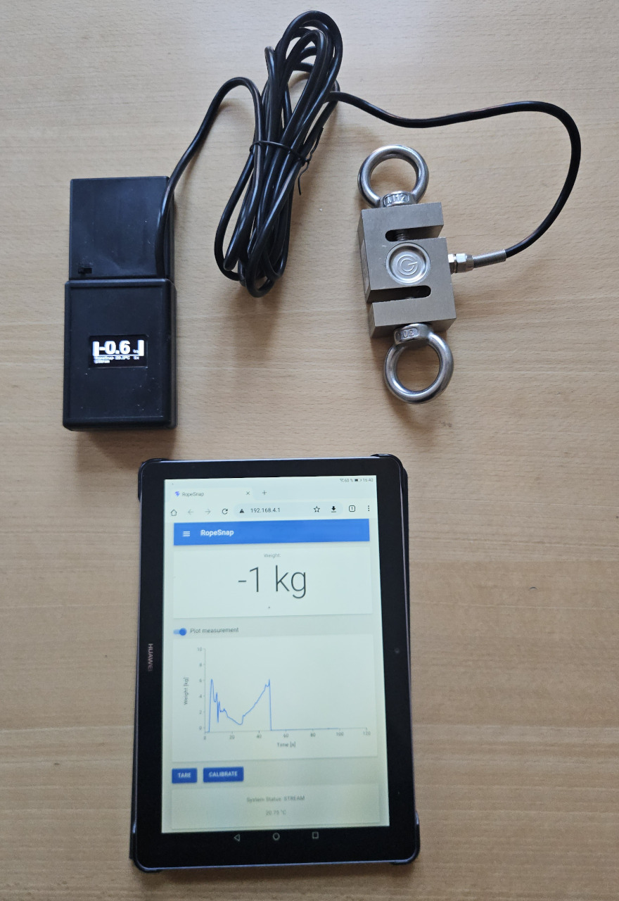
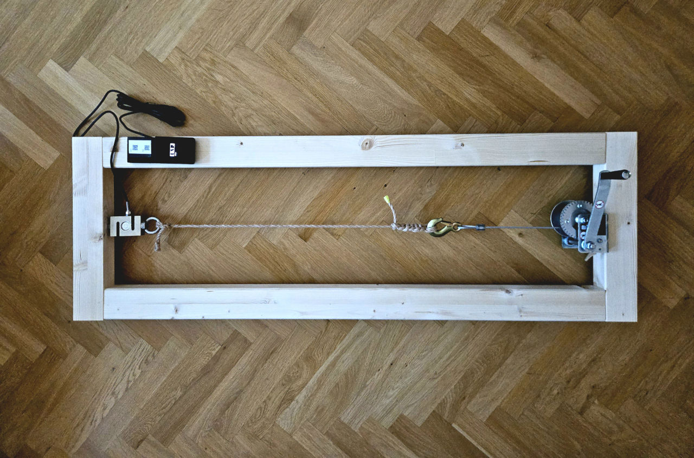
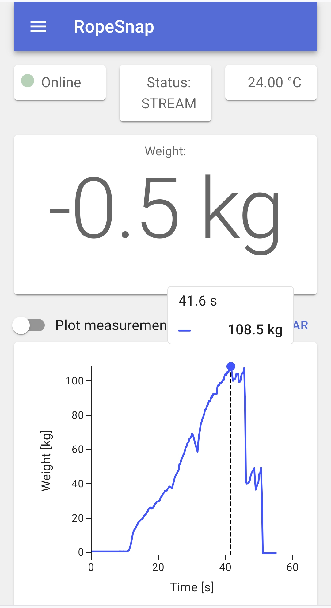
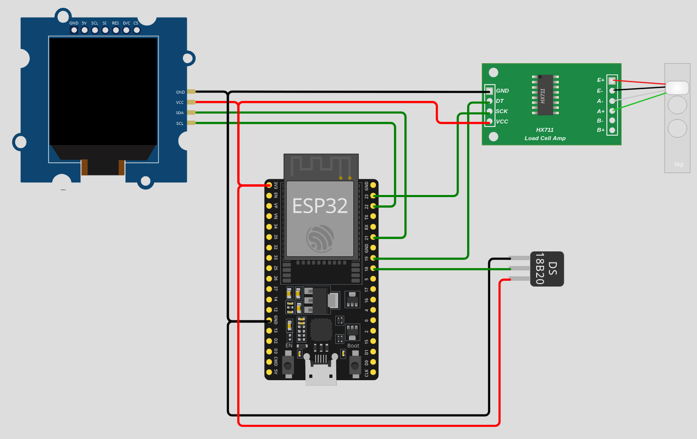
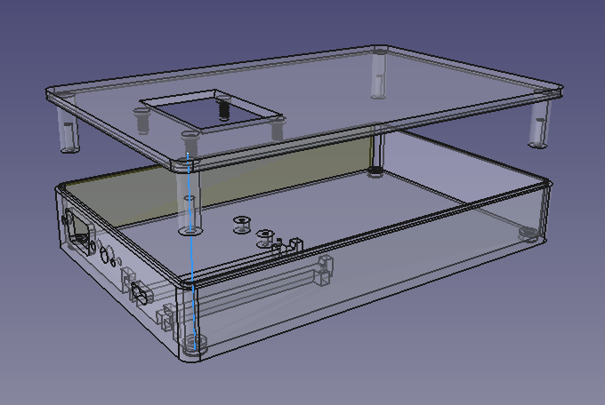

# esp32-load-tester
A simple and low-cost weight/force measurement device, based on an ESP32/ESP8266-module and a [load cell](https://en.wikipedia.org/wiki/Load_cell). It features a web-interface that allows to control and read the measurement. Additionally, a small, built-in OLED display shows the current measurement and the status of the device.

It uses cheap components, only rudimentary calibration and a simple design, resulting in low accuracy (probably ± 5%), and low readout frequency (< 5Hz).

Since any [load cell](https://en.wikipedia.org/wiki/Load_cell) can be used, the magnitude of the measurement range can be selected in a wide range from few grams to multiple tons.

## Applications
The esp-load-tester is suited for _low-accuracy_ measurement of _slowly changing_ forces or weights. Few examples:

- simple tensile strength testing
- hanging scale
- general newton meter

#### Example: Tensile Strength Tester

## System Overview

The force is measured using a [load cell](https://en.wikipedia.org/wiki/Load_cell). The cheap HX711 analog-digital-converter (ADC) is used for measurement of the voltage across the wheatstone bridge of the load cell. Its digital interface is read by a cheap [ESP32](https://en.wikipedia.org/wiki/ESP32) or even cheaper [ESP8266](https://en.wikipedia.org/wiki/ESP8266) micro-controller module. The ESP additionally controls a small OLED display (optional, but recommended), and a digital temperature sensor (purely optional).

The ESP starts a WiFi access point, and up to four _clients_ can connect to this WiFi. The clients can be mobile phones, tablets or any other device with WiFi and browser. In the browser, the user opens `http://192.168.4.1/` to access the web-interface that allows to control and monitor the measurement.

The WiFi uses WPA2-PSK security with a password that is configured at build time. For ease of use, a QR-code with the WiFi's SSID and password is generated. This can be printed and put on the device. Users then simply scan this QR-code to connect to the Wifi. A second QR-code linking to `http://192.168.4.1/` is also generated. 

The web-interface served by a small web-server running on the ESP. The server part is kept simple and consists of a REST-API, a server-side-events (SSE) service, and a server for static files to load a [React.js](https://en.wikipedia.org/wiki/React_(software)) application to the client. The main part of the web-interface then runs on the client's browser, rendering a page with [Material Design](https://en.wikipedia.org/wiki/Material_Design), subscribing to the SSE to fetch the measurment data and plotting the data in a graph. A watchdog checks if the SSE events are coming in periodically, or otherwise indicate that state as _offline_.

## Construction

### Parts
Care has been taken to only use cheap, widely available parts. For obvious reasons no specific suppliers are listed here, but all parts are easily found via web search.

At the time of writing (2026), the parts roughly summed up to around 60 € over cheap suppliers.

|Count|Item|Example|Cost|
|-:|-|-|-:|
|1|Load Cell|500 kg load cell|~ 30 €|
|2|Eye bolts|M12 eye bolts|~ 6 €|
|1|ADC|HX711|~ 1€|
|1|ESP32 development board|ESP32 Dev Kit C, CP2102|~ 7 €|
|1|OLED Display (optional)|SH1106 1.3", 128x64 pixel|~ 3 €|
|1|Temp. sensor (optional)|DS18B20|~ 1 €|
|1|Battery Holder|4xAA/R6 battery holder|~ 1 €|
|1|Power switch|Mini toggle switch on/off|~ 1 €|
|1|D-Sub Plug|Female 9-pin, with case|~ 1 €|
|1|D-Sub Plug|Male 9-pin|~ 1 €|
|1|3D-print of case (optional)|PLA print|~ 7 €|
|||||
|||**Total w/o and with optional parts**|~ 50 - 60 €|

### Wiring
Following table shows the wiring for an common 38-pin ESP32 module (like):

|Category|Component|Pin|<->|Component|Pin|
|-|-|-|-|-|-|
|**Signals**|ESP32|GPIO 21|<->|OLED|SDA|
||ESP32|GPIO 22|<->|OLED|SCL|
||ESP32|GPIO 23|<->|HX711|SCK|
||ESP32|GPIO 19|<->|HX711|DT|
||ESP32|GPIO 18|<->|DS18B20|2 (DQ)|
||
|**Power**|ESP32|Vin / 5V|<->|on/off switch|(COM)|
||on/off switch|(A)|<->|Battery|+|
||ESP32|GND|<->|Battery|-|
||ESP32|GND|<->|OLED|GND|
||ESP32|GND|<->|HX711|GND|
||ESP32|GND|<->|DS18B20|1 (GND)|
||ESP32|3V3|<->|OLED|VCC|
||ESP32|3V3|<->|HX711|VCC|
||ESP32|3V3|<->|DS18B20|3 (VDD)|

The following diagram shows above wiring for the example of a 38-pin ESP32 development board:

### Software
This project is set up for development with [Platform IO](https://platformio.org/), using [Visual Studio Code](https://code.visualstudio.com) as IDE. The web-interface is built using the [Vite](https://vite.dev/) build tool, which is set up for building a [React.js](https://en.wikipedia.org/wiki/React_(software)) application. This setup was tested on [Ubuntu Linux](https://ubuntu.com/).

TODO: Add instructions for other Linux distros, Windows, macOS, etc..

#### Prerequisites
- [Visual Studio Code](https://code.visualstudio.com)
- [Platform IO for VSCode](https://platformio.org/platformio-ide)
- Python 3.12+, installed by default in Linux, for windows [install Python](https://www.python.org/downloads/)

#### Build Instructions

- Repo is set up for VSCode IDE, with PlatformIO extension
  - Open directory in VSCode. PlatformIO should detect platformio.ini and load it automatically
- Custom PlatformIO build targets were added, run them in this order
  1. Generate Secrets (generates WIFI password)
  1. Generate Wifi QR
  1. Build web-if
- Then run standard targets
  1. Build Filesystem Image
  1. Upload Filesystem Image
  1. Build
  1. Upload and Monitor

### Case

A 3d design of a case is included as [FreeCAD](https://www.freecad.org/) model in `mech/case.FCStd`, and an exported STL for printing is in `mech/export/case.stl`.

Warning: This design has not been printed/verified yet.

TODO: Print and verify case.

### Build the Tensile Strength Tester

A simple tensile strength tester can be built using the esp-load-tester. An example build is shown in following photo:

#### Shopping list

|Count|Item|Example|Cost|
|-:|-|-|-:|
|1|_esp-load-tester_|_(see above)_|59 €|
|2|Side bars|Wood bar (8 x 6)cm, length 130 cm, softwood sufficient|20 €|
|2|End bars|Wood bar (8 x 6)cm, length 46 cm, softwood sufficient|7 €|
|1|Hand winch, steel cable|E.g. Einhell TC-WI 500|31 €|
|1|Screw for load cell|M12 x 100mm, [carriage bolt](https://en.wikipedia.org/wiki/Carriage_bolt)|1 €|
|2|Screws for winch|Wood screw ⌀ 6 x 80mm|1 €|
|2|Washers for winch|Washer ⌀ 6.4mm x ⌀ 18mm|1 €|
|8|Screws for bars|Wood screw ⌀ 5 x 100mm|1 €|
|||||
|||**Total**|121 €|